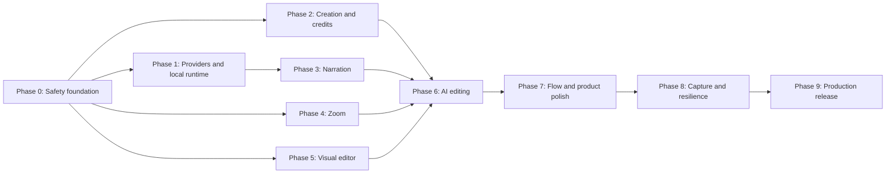

# Fable Production-Ready Interactive Demo Implementation Plan

**Status:** Proposed planning baseline for review; implementation has not started

**Last updated:** 2026-08-31

**Repository baseline:** `29b54bf` on `main`, synchronized with `origin/main`
**Primary objective:** Turn Fable's existing HTML-based interactive demo into a production-ready, AI-first, nontechnical editing product without rewriting the capture, playback, branching, analytics, or publishing foundations.

## 1. Executive summary

Fable already has most of the low-level primitives needed for the proposed product:

- A Chrome extension that records click-driven HTML/DOM snapshots.
- An upload and reconciliation flow from extension storage into a Fable tour.
- Editable serialized HTML screens, image-screen fallback, and screen diffs.
- An annotation and hotspot model.
- Branching through the existing multi-annotation graph.
- Screen-level text, image, blur, hide, mask, and input edits.
- Voiceover generation, audio storage, and narrated playback.
- A runtime zoom/pan implementation.
- Demo publishing, embedding, analytics, lead forms, and personalization.
- An initial AI creation flow and a limited AI editing flow.

The main problem is not missing infrastructure. The problem is that these capabilities are fragmented, coupled to old entitlement/provider assumptions, and exposed through an editor designed around internal DOM mechanics rather than a marketer's mental model.

The implementation will therefore be incremental. It will preserve existing functionality and introduce one shared, typed editing-action layer used by both manual controls and AI. That layer will make AI editing safe, previewable, undoable, testable, and provider-agnostic.

The full scope is substantial but feasible. It should be treated as a sequence of gated phases, not as a single editor rewrite.

## 2. Final product decisions

These decisions supersede earlier ideas discussed during repository exploration.

### 2.1 In scope

1. One primary **HTML-based Interactive Demo** product.
2. Two explicit post-recording paths:
   - **Create with AI**
   - **Create Manually**
3. AI available throughout creation and editing.
4. AI capable of end-to-end semantic editing through controlled tools.
5. No user-facing AI credit balance, purchase prompt, or credit gate.
6. AI voiceover enabled by default, with an obvious global toggle and per-step controls.
7. Provider-agnostic LLM and TTS infrastructure, initially configured for OpenRouter.
8. A first-class visual zoom editor with automatic, manual, and disabled modes.
9. Direct manipulation of annotations, hotspots, zoom regions, and other visual effects.
10. A canvas-first editor designed for marketers and other nontechnical users.
11. Existing technical capabilities retained behind internal or deliberately advanced access.
12. Clear branching terminology and predictable branch/rejoin behavior.
13. Local application and data services, with OpenRouter as the only required external runtime dependency for AI/TTS.
14. Backward compatibility for existing tours and published demos.
15. Production hardening for persistence, privacy, accessibility, observability, and capture fidelity.

### 2.2 Explicitly out of scope

1. A separate screenshot-demo product or a Screenshot/HTML recorder selector.
2. Replacing the React application or rewriting the editor from scratch.
3. Replacing the Java API or splitting the system into new microservices.
4. Allowing an LLM to mutate arbitrary tour JSON, CSS, JavaScript, or database state.
5. Removing the existing image-screen type. Image screens remain useful for uploads, fallback captures, and media-only steps.
6. Deleting custom scripts, custom CSS, or other technical features. They will be moved out of the default user experience.
7. A broad framework/dependency upgrade bundled with feature work.
8. Guaranteed audible autoplay before a viewer interacts with the page; browser autoplay restrictions make that impossible to promise reliably.

## 3. Research findings

### 3.1 Common competitor pattern

The strongest products use the same overall interaction model:

1. Capture first; polish after capture.
2. Keep the recorded product screen as the editor's primary canvas.
3. Present editing as visual modes rather than DOM operations.
4. Let users click, drag, resize, reorder, and preview directly.
5. Treat zoom and narration as step-level presentation properties.
6. Let AI generate a first draft, then let the user review and refine it.
7. Express branching as paths, choices, flows, or chapters—not as an annotation implementation detail.
8. Keep playback, analytics, and sharing attached to the same underlying demo.

#### HowdyGo

The inspected HowdyGo editor uses a canvas-first layout with modes for Edit UI, Blur UI, Hide UI, Zoom, Narration, Chapters, Playback, Preview, and Share. Zoom is set by dragging and resizing a visible rectangle. Narration is contextual to the current step. Its AI assistant exposes high-level tasks such as creating the demo, improving structure, translating, anonymizing PII, and suggesting chapters. The documented default is to ask before editing, with auto-apply available separately.

Primary references:

- [Howdy AI](https://docs.howdygo.com/ai)
- [Write demo content with AI](https://docs.howdygo.com/ai/interactive-demos/write-demo-content)
- [Narration](https://docs.howdygo.com/create/narration)
- [Editing steps](https://docs.howdygo.com/create/editing-steps)
- [Editing HTML](https://docs.howdygo.com/create/editing-html)
- [Auto-progress](https://docs.howdygo.com/create/auto-progress)

#### Storylane

Storylane exposes AI creation, AI HTML editing, AI voiceover, auto-zoom during capture, and manual Track & Zoom. Its HTML editor allows direct selection of text, images, SVG charts, blur/hide/delete, and global search/replace. Voiceover is attached to an individual step and can be AI-generated, recorded, or uploaded.

Primary references:

- [AI demo creation](https://docs.storylane.io/editing-demos/ai-demo-creation)
- [Editing HTML screens](https://docs.storylane.io/editing-demos/editing-html-screens)
- [Video overlays and voiceovers](https://docs.storylane.io/editing-demos/guided-steps/video-overlays-and-voiceovers)
- [Recording and auto zoom](https://docs.storylane.io/recording-demos/recording-screenshot-demos)
- [Track & Zoom](https://docs.storylane.io/editing-demos)

#### Navattic

Navattic's recent product direction reinforces the same pattern: a single-step building view, Copilot-generated first drafts, Copilot review suggestions, step voiceovers, translations, multiple flows, and conditional demos. Its public documentation also describes keyboard-accessible viewer controls and authored ARIA labels.

Primary references:

- [Navattic documentation](https://docs.navattic.com/)
- [Navattic product updates](https://docs.navattic.com/changelog)
- [Accessibility and builder FAQs](https://docs.navattic.com/help/faqs)

#### Supademo and Arcade

Supademo describes conditional branching as chapter buttons that jump to any step and supports AI or recorded voiceover per step or across a complete demo. Arcade presents branching, zero-code page editing, pan/zoom, synthetic voiceover, and analytics as parts of one editor.

Primary references:

- [Supademo chapters and conditional branching](https://docs.supademo.com/editing/chapters)
- [Supademo voiceover](https://docs.supademo.com/customize/voiceovers)
- [Arcade interactive demos](https://www.arcade.software/product/interactive-demo)

### 3.2 Product conclusion from competitor research

Fable should adopt the interaction principles, not clone a competitor's visual design:

- Canvas first.
- Contextual modes.
- Direct manipulation.
- AI proposes semantic changes.
- Human approval is the safe default.
- Every AI action has a manual equivalent.
- Voiceover, zoom, playback, and branching remain properties of one demo.

### 3.3 OpenRouter validation

The requested initial models are currently valid OpenRouter model identifiers:

- LLM: `z-ai/glm-5.3-flash`
- TTS: `deepgram/flux-tts:free`
- Initial voice: `flux-alexis-en`

OpenRouter currently documents the following relevant behavior:

- `z-ai/glm-5.3-flash` accepts text, image, and video input and supports `tools` and `tool_choice`.
- It accepts response-format parameters, but Fable must still perform runtime schema validation and cannot trust model output as valid tour edits.
- OpenRouter standardizes tool calling across supported models and providers.
- TTS uses `POST /api/v1/audio/speech` and returns raw audio bytes.
- `deepgram/flux-tts:free` accepts `flux-alexis-en` and is currently free, but free endpoints are rate limited.
- Voice identifiers and supported parameters remain model/provider-specific.
- Provider routing can require supported parameters, control fallback behavior, and restrict data collection or request zero-data-retention endpoints where available.

Primary references:

- [GLM 5.3 Flash](https://openrouter.ai/z-ai/glm-5.3-flash)
- [Flux TTS free](https://openrouter.ai/deepgram/flux-tts:free)
- [Tool calling](https://openrouter.ai/docs/guides/features/tool-calling)
- [Structured outputs](https://openrouter.ai/docs/guides/features/structured-outputs)
- [Text-to-speech](https://openrouter.ai/docs/guides/overview/multimodal/tts)
- [Provider routing](https://openrouter.ai/docs/guides/routing/provider-selection)

The model names must remain configuration, not constants embedded throughout the code. A startup capability check and deterministic mocked providers are required because catalog availability and supported parameters may change.

### 3.4 Browser and accessibility constraints

Voiceover being enabled by default means generation and player intent are enabled by default. It does not mean that a browser can always play audible media immediately. Chrome allows muted autoplay but normally requires prior user interaction for autoplay with sound. `play()` may reject with `NotAllowedError` when that requirement is not satisfied. The player must offer a clear Start/Play narration interaction and handle rejected playback without surfacing an uncaught error.

Reference: [Chrome autoplay policy](https://developer.chrome.com/blog/autoplay/).

The visual editor must not make dragging the only way to move or resize objects. WCAG 2.2 requires keyboard operability and specifically addresses dragging movements, focus order, visible focus, focus not being obscured, and minimum target size. The editor must provide keyboard alternatives and accessible labels for canvas controls.

References:

- [WCAG 2.2](https://www.w3.org/TR/WCAG22/)
- [What's new in WCAG 2.2](https://www.w3.org/WAI/standards-guidelines/wcag/new-in-22/)

## 4. Current architecture and reusable foundations

### 4.1 Existing end-to-end pipeline

```text
Chrome extension
  -> serialized DOM, styles, interaction target, thumbnails, frames
  -> extension IndexedDB
  -> /preptour transfer and reconciliation
  -> /create-interactive-demo
  -> tour JSON + screen assets
  -> editor / preview / player
  -> publish / embed / analytics
```

### 4.2 Primary code boundaries

| Area | Current code boundary |
| --- | --- |
| Extension coordination | `app/workspace/packages/ext-tour/src/background.ts` |
| DOM/style capture | `app/workspace/packages/ext-tour/src/doc.ts` |
| Extension-to-client transfer | `app/workspace/packages/ext-tour/src/client_content.ts` |
| Recording preparation | `app/workspace/packages/client/src/container/create-tour/prep-tour.tsx` |
| Post-record creation | `app/workspace/packages/client/src/container/create-tour/index.tsx` |
| Creation helpers/AI mapping | `app/workspace/packages/client/src/container/create-tour/utils.ts` |
| Tour editor orchestration | `app/workspace/packages/client/src/container/tour-editor/index.tsx` |
| Local edit batching | `app/workspace/packages/client/src/container/tour-editor/chunk-sync-manager.ts` |
| Screen editor | `app/workspace/packages/client/src/component/screen-editor/index.tsx` |
| Annotation controls | `app/workspace/packages/client/src/component/screen-editor/annotation-creator-panel.tsx` |
| Playback and zoom runtime | `app/workspace/packages/client/src/component/screen-editor/preview.tsx` |
| Published preview and current AI prompt | `app/workspace/packages/client/src/container/publish-preview/index.tsx` |
| Client API actions, AI update, voiceover | `app/workspace/packages/client/src/action/creator.ts` |
| Shared tour model | `app/workspace/packages/common/src/types.ts` |
| Shared API contract/schema version | `app/workspace/packages/common/src/api-contract.ts` |
| Current LLM contract/router | `app/workspace/packages/common/src/llm-contract/` and `llm-fn-schema/` |
| LLM jobs | `jobs/src/http/llm-ops/` |
| TTS jobs | `jobs/src/http/audio-ops.ts` |
| API subscription/credit logic | `api/src/main/java/com/sharefable/api/controller/v1/SubscriptionController.java` and `service/SubscriptionService.java` |

### 4.3 Reuse versus change

| Capability | Reuse | Required change |
| --- | --- | --- |
| HTML capture | Existing serializer, frame collection, styles, assets | Add systematic fidelity fixtures and diagnostics |
| Image screens | Existing fallback/manual media type | Retain; do not create a separate screenshot product |
| Annotation rendering | Existing annotation lifecycle and configuration | Add semantic on-canvas selection and movement |
| Branching | Existing graph and branch/rejoin behavior | Rename and redesign UI; preserve IDs and analytics |
| Screen edits | Existing text/image/blur/hide/mask/input edit encoding | Wrap in visual modes and AI actions |
| Zoom playback | Existing scale/translate runtime | Decouple from voiceover; persist and author zoom state |
| Voiceover | Existing per-annotation audio/voice metadata and playback | Provider abstraction, default policy, per-step UI, status/retry |
| AI creation | Existing AI/manual state and prompt pipeline | Replace credit gating; make modes explicit; use typed actions |
| AI editing | Existing content/theme update seed | Move to core editor and expand safely through tools |
| Tour JSON persistence | Existing versioned document and normalizers | Add a new schema version and reliable save/undo semantics |
| Analytics | Existing viewer and CTA analytics | Preserve and add authoring/AI operational telemetry |

## 5. Baseline constraints and known debt

The roadmap must account for the following existing conditions.

### 5.1 Large stateful editor components

`create-tour`, `screen-editor`, and related class components hold substantial local state and side effects. The implementation must introduce focused boundaries around new behavior instead of adding more unrelated state to these files. A full React rewrite is not justified.

### 5.2 Persistence can lose edits on failure

`ChunkSyncManager.poll()` removes cached edits immediately after invoking the sync callback. The code itself notes that edits can be lost if the server fails. AI will create larger multi-operation updates, so persistence acknowledgement, retry, and conflict handling are prerequisites rather than optional cleanup.

### 5.3 Existing AI context slicing defect

The single-annotation AI update uses `demoState.slice(startIndex, batchSize)` instead of an end index based on `startIndex + batchSize`. Later annotations can receive incomplete or empty context. This must be covered and corrected during the safety-foundation phase.

### 5.4 No durable authoring undo/redo

The existing `Tx` object groups callbacks; it is not a command history and cannot reliably invert applied edits. Published-preview AI keeps a small in-memory history, but that is not a durable editor-wide undo model.

### 5.5 Schema version is effectively frozen

The shared contract declares only `SchemaVersion.V1 = "2023-01-10"`. New optional properties can be tolerated by JSON storage, but production-safe migration requires an explicit next version and normalization rules.

### 5.6 AI/TTS and shared contracts are provider-specific

The jobs service imports Anthropic types and uses a hardcoded Claude model. TTS calls OpenAI `tts-1`, and the client exposes OpenAI-specific voices and remote sample URLs. Provider SDK types must not leak into Fable domain contracts.

### 5.7 Credit logic is cross-layer

AI credits appear in the creation flow, preview AI, voiceover popup, header, billing UI, jobs deductions, generated API contracts, and API subscription logic. Removing only buttons would leave inconsistent and potentially blocking backend behavior.

### 5.8 Local mode still depends on cloud services

The local client profile points its CDN to a remote S3 bucket and uses Auth0. The API supports configurable S3/SQS endpoints, but jobs constructs AWS clients without equivalent LocalStack endpoints and requires unrelated integration variables at startup. Local operation is therefore not yet self-contained.

### 5.9 Test distribution is uneven

Current client tests are strongest around recent branch playback and screen utilities. There are few targeted tests for creation modes, AI editing, voiceover orchestration, zoom, credit-free behavior, provider adapters, persistence retry, and full extension-to-editor flow. Browser E2E infrastructure is absent.

### 5.10 Documentation contains superseded scope

The root README still refers to a planned Screenshot/HTML recording split. When implementation begins, project documentation must be updated to reflect the final HTML-interactive-demo scope.

## 6. Target product experience

### 6.1 Post-recording creation

After processing a recording, the user sees two equal cards:

#### Create with AI

- Selected by default.
- Brief product/workflow description.
- Demo objective and optional audience/tone/language.
- Voiceover enabled by default with voice selection and a visible toggle.
- AI explains what it will do: remove unnecessary steps, generate copy, apply theme, configure zoom, and prepare narration.
- The user can continue even if optional fields are empty; the AI should use captured context and safe defaults.

#### Create Manually

- Equal visual priority.
- Opens the same editor with captured steps and baseline annotations.
- Voiceover remains enabled by default but can be disabled before creation.
- AI remains available inside the editor; choosing manual does not permanently opt out of AI.

There must be no credits, credit count, purchase button, or upgrade gate in this workflow.

### 6.2 Core editor layout

The desired editor has four primary regions:

1. **Top product toolbar**
   - Undo/redo.
   - Preview.
   - Share/publish.
   - AI copilot.
   - Save/sync status.

2. **Step filmstrip or compact flow rail**
   - Reorder, duplicate, insert, delete, branch, and chapter actions.
   - Clear badges for narration, zoom, branch, form, media, and warnings.

3. **Recorded-product canvas**
   - Direct selection.
   - Drag/resize handles.
   - Visible annotation, hotspot, zoom, blur, and selection overlays.
   - No raw DOM node names in the default experience.

4. **Contextual inspector**
   - Shows settings relevant to the selected object or mode.
   - Content, position, appearance, action, narration, zoom, and timing in plain language.
   - Advanced technical settings are hidden from standard users.

### 6.3 Editing modes

The default toolbar should expose understandable modes:

- Annotate.
- Edit UI.
- Blur/Hide/Mask.
- Zoom.
- Narration.
- Playback.
- Branch.

Technical implementation concepts such as AEP, element path, `div`, CSS selectors, and custom CSS must not appear in the normal workflow.

### 6.4 AI copilot behavior

AI should be available:

- During post-record creation.
- Globally in the editor.
- Contextually for the selected step, annotation, zoom, narration, or screen element.

Default mode: **Review before applying**.

Optional user preference: **Auto-apply safe edits**.

AI responses should produce an edit plan such as:

```text
3 changes proposed
1. Shorten annotation 2.
2. Move its tooltip so it does not cover the button.
3. Add an automatic zoom and regenerate narration for that step.
```

The user can apply all, apply individual changes, reject, or modify the request. Every applied plan is one undoable transaction.

### 6.5 Voiceover

- Enabled by default for newly created demos.
- Global on/off toggle during creation and editing.
- Per-step override.
- Default configured voice: `flux-alexis-en`.
- Script derived from final annotation content unless manually overridden.
- Voice, language, mode/style, and speed shown only when supported by the selected provider/model.
- Generation is asynchronous, retryable, and non-blocking.
- Captions are generated from the script and editable.
- Changing script/model/voice marks only affected audio stale.
- A viewer interaction starts audible narration when autoplay is restricted.

### 6.6 Zoom

Each interactive step supports:

- **Automatic:** focus calculated from the annotation target or recorded interaction.
- **Manual:** author drags/resizes a normalized focus rectangle.
- **Off:** no camera move.

Controls:

- Zoom percentage or fit-to-region.
- Duration.
- Easing using a small curated set.
- Preview.
- Reset.
- Copy to selected steps where appropriate.

Zoom must work independently of voiceover and consistently across HTML screens, image screens, responsive scaling, scroll positions, browser frames, preview, live player, embed, and export paths that use the player.

### 6.7 Branching and terminology

The internal data model may continue using existing multi-annotation identifiers for compatibility. The user-facing feature should be named **Branch** or **Branch path**.

Expected behavior:

- A branch can target any valid step/screen.
- A branch can contain one or more steps.
- By default, a terminal branch rejoins the next step after its origin.
- An author can explicitly select another rejoin destination or end the demo.
- Nested branches remain supported if the graph is valid.
- The editor visualizes origin, destination, and rejoin behavior before publishing.
- Cycle detection prevents accidental infinite flows while intentional loops require explicit confirmation.

The existing tested `A1 -> A2 -> B1 -> A3` behavior remains valid; it is not the only possible route.

### 6.8 Interactive Tour and Interactive Video

These should not behave like unrelated products. They are two playback presentations of the same tour data:

- **Interactive:** viewer controls progression.
- **Auto-play/Narrated:** progression follows narration/timing while retaining supported interaction.

The current “Interactive Video” label should be evaluated through usability testing. “Auto-play” or “Narrated” is likely clearer because Fable is not rendering a conventional video file in this workflow.

## 7. Target technical architecture

### 7.1 Shared editing-action layer

Introduce a domain-level editing API that is independent of React components and AI providers.

Conceptual shape:

```ts
type DemoEditSource = 'manual' | 'ai' | 'migration' | 'system';

interface DemoEditPlan {
  id: string;
  tourId: string;
  expectedRevision: number;
  source: DemoEditSource;
  summary: string;
  operations: DemoEditOperation[];
}
```

Initial semantic operations should cover:

- Update annotation content.
- Create/delete/duplicate annotation.
- Move/re-anchor/resize annotation.
- Change annotation type and appearance.
- Configure hotspot action.
- Reorder/insert/duplicate/delete step.
- Apply screen text/image/blur/hide/mask edit.
- Configure zoom.
- Configure narration and script.
- Configure playback/transition.
- Configure branch destination/rejoin.
- Update theme.
- Update tour metadata.

Processing pipeline:

```text
create plan
  -> validate schema
  -> validate domain invariants
  -> calculate human-readable diff
  -> preview/approve when required
  -> apply atomically
  -> persist with revision
  -> record audit metadata
  -> expose inverse operation for undo
```

Manual UI controls and AI tool calls must use this same path. Existing functions can be adapted behind operation handlers; they do not all need to be rewritten immediately.

### 7.2 AI tool registry

The LLM receives a versioned, allow-listed tool catalog generated from the editing-action layer. The LLM proposes tool calls; Fable executes them after validation. The model never receives direct database, filesystem, JavaScript execution, arbitrary CSS, or raw persistence access.

Tool categories:

1. Read-only context tools.
2. Content and metadata tools.
3. Annotation and step tools.
4. Presentation tools: zoom, narration, playback, transition.
5. Safe screen-edit tools.
6. Branch and chapter tools.
7. Review tools: inspect structure, identify overlap, detect missing CTA, detect PII candidates.

AI context should be minimized:

- Current tour graph and relevant neighboring steps.
- Selected annotation or object.
- Sanitized visible text and metadata.
- Captured interaction target and bounded image references when visual understanding is required.
- Tour objective, audience, tone, brand, and language.

Do not send the full captured DOM by default.

### 7.3 Provider abstraction

Introduce server-side interfaces such as:

```ts
interface LlmProvider {
  getCapabilities(model: string): Promise<LlmCapabilities>;
  complete(request: DomainLlmRequest): Promise<DomainLlmResponse>;
}

interface TtsProvider {
  getCapabilities(model: string): Promise<TtsCapabilities>;
  synthesize(request: DomainTtsRequest): Promise<TtsAudioResult>;
}
```

Initial environment configuration:

```dotenv
AI_PROVIDER=openrouter
AI_MODEL=z-ai/glm-5.3-flash
AI_REASONING_EFFORT=low

TTS_PROVIDER=openrouter
TTS_MODEL=deepgram/flux-tts:free
TTS_VOICE=flux-alexis-en

OPENROUTER_API_KEY=...
OPENROUTER_BASE_URL=https://openrouter.ai/api/v1
```

Rules:

- Secrets remain in jobs/server configuration, never client bundles.
- Shared contracts use Fable domain types, not Anthropic/OpenAI SDK types.
- Timeouts, retry policy, provider fallback, data-collection policy, and ZDR preference are configuration.
- Tool and structured output support is capability-checked.
- Every model response is runtime validated before becoming an edit plan.
- Provider errors are normalized into retryable, non-retryable, rate-limit, validation, and unavailable categories.
- A deterministic mock provider supports offline tests.

### 7.4 Tour schema evolution

Add a new schema version rather than silently treating new authoring state as unversioned data.

Conceptual additions:

```ts
interface StepPresentationConfig {
  zoom?: {
    mode: 'auto' | 'manual' | 'off';
    region?: { x: number; y: number; width: number; height: number };
    scale?: number;
    durationMs?: number;
    easing?: 'standard' | 'gentle' | 'fast';
  };
  playback?: {
    autoAdvance?: boolean;
    delayMs?: number;
    animateToNext?: boolean;
  };
}

interface StepNarrationConfig {
  enabled: boolean;
  scriptMode: 'annotation' | 'custom';
  script?: string;
  voice?: string;
  language?: string;
  speed?: number;
  status: 'idle' | 'queued' | 'generating' | 'ready' | 'stale' | 'failed' | 'disabled';
  asset?: ExistingAudioReference;
  inputHash?: string;
}
```

The final field placement must follow Fable's annotation-as-step model. Tour-level defaults should live in tour options; step overrides should live on the annotation/step. Normalized zoom coordinates must use captured-content coordinates, not browser pixels or raw CSS transforms.

Compatibility rules:

- Existing tours without new fields continue current behavior.
- Existing voiceover metadata and audio URLs remain playable.
- Undefined zoom on an existing voiceover step preserves legacy automatic zoom until explicitly edited.
- Existing branch IDs and routes are not rewritten for a terminology change.
- Migrations are pure, deterministic, idempotent, and covered by fixtures.

### 7.5 Reliable persistence, undo, and concurrency

Required behavior:

- Local edit journal is retained until server acknowledgement.
- Failed saves retry with bounded exponential backoff and visible status.
- Closing/reloading the editor restores unacknowledged edits.
- Each master tour save carries an expected revision or equivalent conflict token.
- Conflicts are detected rather than silently overwriting newer data.
- One edit plan is one undo entry.
- Undo/redo uses inverse semantic operations, not a shallow component-state snapshot.
- AI plan previews do not alter persisted data.
- Regenerating narration or other async assets updates the tour only after the asset is successfully stored.

### 7.6 Local-first runtime

Target local architecture:

```text
Client + extension: localhost
API: localhost
Jobs HTTP/worker: localhost
MySQL/PostgreSQL: Docker
S3/SQS: LocalStack
Authentication: explicitly local development identity/provider
AI/TTS: OpenRouter
```

Required changes:

- Jobs AWS clients accept S3/SQS endpoint, path-style, and local credentials.
- Local frontend CDN points to the local object-store endpoint.
- Jobs can start the required HTTP AI/TTS endpoints without unrelated optional integrations.
- Optional workers/integrations validate configuration only when enabled.
- A local authentication mode is available only under an explicit local profile; production startup must reject it.
- The explicit local profile grants the seeded developer account all authoring capabilities without subscription or upgrade gates; this bypass must be impossible to enable in a production build or profile.
- Seed scripts create a local user, organization, buckets, queue, and minimal demo fixtures.
- Docker health checks and a single documented startup flow are provided.
- Automated tests remain fully offline through mock LLM/TTS providers.

### 7.7 Security and privacy

- Sanitize captured HTML and all generated rich text before rendering.
- Keep scripts excluded from captured screens.
- Enforce allow-listed semantic AI actions.
- Minimize AI context and redact obvious secrets/PII candidates before provider calls.
- Support configurable OpenRouter `data_collection: deny` and ZDR routing where compatible.
- Log metadata, model, latency, tool name, and error class—not prompt contents or captured DOM by default.
- Maintain an audit record of AI-applied authoring operations without storing model reasoning.
- Validate uploaded media type, size, and content before publishing.
- Never expose OpenRouter credentials to the extension or browser application.

## 8. Phase-wise implementation plan

### Dependency overview



Phases may overlap only where their dependency gates are satisfied. No phase is considered complete because its UI renders; its acceptance and regression gates must pass.

The sizes below are relative engineering sizes, not calendar promises. Calendar estimates should be produced only after Phase 0 validates the persistence, schema, and browser-E2E assumptions and the available team capacity is known.

### Phase 0 — Safety foundation and characterization

**Relative size:** Medium

**User-facing change:** Minimal

**Purpose:** Create a safe base for every later feature.

#### Work

1. Add characterization tests for:
   - Current creation and manual fallback behavior.
   - Tour schema normalization.
   - Existing voiceover playback.
   - Existing legacy zoom behavior.
   - Screen edits.
   - Branching, nested branches, lead forms, and analytics mapping.
2. Introduce the typed `DemoEditPlan`/`DemoEditOperation` domain layer.
3. Adapt one low-risk manual action through the new layer as a vertical proof.
4. Add domain validation and human-readable plan diff generation.
5. Define inverse operations and editor-wide command history.
6. Add explicit next-schema-version scaffolding and old-tour fixtures.
7. Fix the single-annotation context slicing defect with regression coverage.
8. Make cached-edit deletion acknowledgement-based.
9. Add save retry/status behavior and tests for reload recovery.
10. Add initial revision/conflict contract design across client and API.
11. Introduce browser E2E infrastructure, preferably one deliberate Playwright dependency rather than ad hoc scripts.

#### Acceptance gate

- Existing demos load and play identically from legacy fixtures.
- A semantic edit can be applied, persisted, undone, redone, and recovered after reload.
- A failed save leaves the edit journal intact.
- A stale revision produces a handled conflict rather than a silent overwrite.
- Current CI remains green and includes at least one editor browser smoke test.

### Phase 1 — Provider abstraction and local runtime foundation

**Relative size:** Medium–large

**Purpose:** Remove Anthropic/OpenAI coupling and make AI/TTS locally operable through OpenRouter.

#### Work

1. Replace provider SDK types in shared contracts with Fable domain requests/responses.
2. Implement `LlmProvider` and `TtsProvider` interfaces.
3. Implement OpenRouter LLM adapter.
4. Implement OpenRouter speech adapter for raw audio streams.
5. Configure the initial model/voice values through environment variables.
6. Add runtime model capability discovery/validation and health reporting.
7. Validate every tool response through the generated schema plus domain invariants.
8. Normalize provider errors and add timeout/retry/backoff behavior.
9. Add deterministic mock LLM/TTS providers for CI and offline development.
10. Add LocalStack endpoint support to jobs S3/SQS clients.
11. Decouple optional integrations from jobs startup.
12. Add explicit local authentication profile and seed data with production guardrails.
13. Give the seeded local developer account explicit full-feature authoring access without production plan checks.
14. Add AI/TTS usage telemetry that is operational, not user credit accounting.

#### Acceptance gate

- No Anthropic/OpenAI SDK type appears in Fable's domain contracts.
- Existing LLM operations run through the OpenRouter adapter.
- TTS generates and stores playable audio using `deepgram/flux-tts:free` and `flux-alexis-en` in an opt-in smoke test.
- CI uses mocks and requires no external key.
- API, jobs, databases, queue, and object storage run locally; only enabled real AI/TTS calls leave the machine.
- Missing optional integration variables do not prevent core local startup.
- The local developer account can exercise every authoring feature without an upgrade modal, while production profiles cannot activate the bypass.

### Phase 2 — Post-recording creation UX and removal of AI credits

**Relative size:** Medium

**Purpose:** Make AI/manual creation understandable and remove credit-based friction.

#### Work

1. Replace the current AI-first page plus manual text link with equal AI/manual cards.
2. Keep AI selected by default while making manual creation a first-class path.
3. Preserve recording recovery and save-in-existing-demo behavior.
4. Remove all AI credit balances, purchase buttons, and gates from:
   - Header.
   - Creation flow.
   - Preview AI.
   - Voiceover.
   - Related billing copy.
5. Remove LLM/TTS dependency on `/deductcredit`.
6. Retire AI-credit-specific API paths and generated contract members when no remaining caller uses them.
7. Preserve unrelated subscription/billing functionality unless a separate business decision removes paid plans entirely.
8. Add explicit failure fallback from AI creation to manual editing without re-recording.
9. Add progress states that describe actual work rather than synthetic percentage-only progress.
10. Update root documentation to remove the superseded screenshot-demo scope.

#### Acceptance gate

- Users can create with AI or manually from the same recording.
- Neither path checks or displays AI credits.
- AI failure never loses the recording and never blocks manual completion.
- No “Buy More Credit” or equivalent remains in the application.
- Backend LLM/TTS execution no longer invokes credit deduction.
- Existing plan entitlements unrelated to AI credits continue functioning unless explicitly changed.

### Phase 3 — Default narration and voiceover editor

**Relative size:** Medium–large

**Purpose:** Make narration a reliable default part of every new demo.

#### Work

1. Add tour-level narration defaults and step-level overrides.
2. Enable narration by default in both AI and manual creation.
3. Add a clear global toggle before creation and in the editor.
4. Add per-step narration mode to the contextual editor.
5. Derive scripts from finalized annotation content; support custom scripts.
6. Implement status lifecycle: idle, queued, generating, ready, stale, failed, disabled.
7. Hash script/model/voice/speed to avoid duplicate regeneration.
8. Regenerate only affected steps when content or voice changes.
9. Add voice preview and capability-aware controls.
10. Generate editable captions from narration text.
11. Handle rate limits and provider failure without blocking editing or publishing.
12. Make audible playback begin after a qualifying viewer action when required by browser policy.
13. Preserve legacy voiceover assets and avoid automatic paid regeneration of old demos.

#### Acceptance gate

- A new AI-created demo receives narration for every eligible step by default.
- A manually created demo clearly indicates narration is on and allows disabling it.
- The editor remains usable while audio generates.
- Failed steps can retry individually.
- Voice changes invalidate and regenerate only affected audio.
- Player controls work when autoplay succeeds and when it is blocked.
- Captions are available and synchronized with step narration.

### Phase 4 — First-class zoom model and visual authoring

**Relative size:** Large

**Purpose:** Turn the existing runtime effect into an independent, editable feature.

#### Work

1. Add schema-backed automatic/manual/off zoom configuration.
2. Preserve legacy automatic voiceover zoom for old tours.
3. Decouple zoom events from `annotationType === 'voiceover'`.
4. Extract zoom geometry and interpolation into testable pure functions.
5. Build visual focus-region overlay with drag/resize handles.
6. Store normalized coordinates relative to captured content.
7. Add curated duration/easing/scale controls, reset, preview, and copy.
8. Account for scroll offset, Mac/browser frame, responsive scaling, nested frames, and image screens.
9. Integrate zoom thumbnails/badges in the step rail.
10. Ensure reduced-motion behavior can disable or simplify camera animation.

#### Acceptance gate

- Automatic zoom focuses the intended annotation target.
- Manual region renders consistently across editor, preview, live, and embed.
- Zoom works with and without voiceover.
- Resizing the browser or changing responsive strategy does not move focus to an unrelated region.
- Image and serialized-DOM screens follow the same authoring model.
- Reduced-motion mode avoids disorienting transitions.
- Geometry, migration, and visual browser tests pass.

### Phase 5 — Canvas-first visual editor and direct manipulation

**Relative size:** Extra large

**Purpose:** Replace the developer-oriented interaction model without replacing the underlying edit engine.

#### Work

1. Introduce the canvas-first editor shell and mode toolbar.
2. Move step navigation into a compact visual rail/filmstrip.
3. Implement direct selection of annotations, hotspots, and visual effects.
4. Add drag, resize, re-anchor, keyboard nudge, alignment, and boundary constraints.
5. Store semantic normalized offsets rather than raw transforms.
6. Show selected-object outlines and contextual handles on the canvas.
7. Reuse existing screen-edit encoding behind Edit UI, Blur, Hide, and Mask modes.
8. Let users click visible text/images/elements rather than inspect DOM paths.
9. Keep a right contextual inspector with plain-language controls.
10. Hide AEP/DOM breadcrumbs, custom CSS, custom scripts, and raw technical settings from standard users.
11. Preserve technical controls behind an internal/admin capability boundary.
12. Add overlap detection and “move to clear space” suggestions.
13. Add accessible keyboard equivalents, focus management, target sizes, and labels.
14. Keep selection and editing stable through screen transitions and responsive preview changes.

#### Acceptance gate

- A nontechnical user can create and modify an annotation without seeing a tag name or element path.
- Existing annotations can be selected by clicking their rendered object.
- Dragging and keyboard movement produce the same persisted semantic position.
- UI text/image/blur/hide actions reuse existing screen edit behavior.
- No core editor action requires custom CSS.
- Existing demos preserve their appearance and remain editable.
- Keyboard-only and screen-reader smoke tests cover the primary authoring flow.

### Phase 6 — End-to-end AI editing copilot

**Relative size:** Extra large

**Purpose:** Give AI controlled access to all relevant editing capabilities.

#### Work

1. Move the primary AI copilot into the core editor.
2. Retain contextual AI affordances in selected-object panels.
3. Build versioned tools on top of `DemoEditOperation`.
4. Support AI changes for:
   - Copy, tone, translation, and personalization.
   - Themes and annotation appearance.
   - Annotation creation/removal/type/position.
   - Hotspots and CTAs.
   - Step cleanup, reorder, duplicate, insert, and removal.
   - Zoom.
   - Narration scripts and voice configuration.
   - Playback and transitions.
   - Branch destinations and rejoin points.
   - Safe text/image/blur/hide screen edits.
   - Chapters and demo metadata.
5. Add plan preview, per-operation approval, apply-all, reject, and undo.
6. Make review-before-apply the default.
7. Allow optional auto-apply only for actions classified as safe and reversible.
8. Add AI “Create my demo,” “Improve structure,” “Shorten,” “Translate,” “Anonymize,” and “Review” workflows.
9. Keep unsupported requests honest; explain what cannot be done.
10. Add prompt-injection resistance: captured page text is untrusted content, never instruction authority.
11. Scope provider context and redact PII/secrets before calls.
12. Add deterministic evaluation fixtures for tool selection and edit-plan quality.

#### Acceptance gate

- Every AI mutation maps to a validated semantic operation.
- No AI request directly rewrites raw tour JSON.
- Proposed changes are understandable before application.
- One AI plan can be fully undone.
- Malformed, unsupported, or unsafe tool requests make no state change.
- AI can complete a representative demo edit involving copy, placement, zoom, narration, and step structure.
- Manual editing remains fully available when AI is offline or rate limited.

### Phase 7 — Flow, branching, playback, and terminology polish

**Relative size:** Medium

**Purpose:** Make existing advanced behavior understandable rather than hidden or confusing.

#### Work

1. Rename visible “Multi-annotation” actions to Branch/Branch path.
2. Keep existing stored identifiers and APIs for compatibility unless a future migration is necessary.
3. Add a visual branch editor showing origin, destination, branch steps, and rejoin.
4. Support explicit connect-to-any-step and end-demo actions.
5. Add graph validation, cycle warnings, missing destination recovery, and delete/reorder repair.
6. Clarify Next/Back behavior inside branches.
7. Add simple chapters as named navigation points over existing steps.
8. Add global auto-progress plus per-step override and narration-aware timing.
9. Clarify Interactive versus Auto-play/Narrated presentation naming.
10. Ensure progress bars and analytics represent the main path and branches correctly.

#### Acceptance gate

- Authors understand the effect of a branch before previewing.
- `A1 -> A2 -> B1 -> A3`, cross-screen, nested, direct-link, Back, lead-form, reorder, delete, and terminal cases pass.
- Branch analytics do not produce false demo completion or CTA events.
- Chapters and auto-progress do not break manual hotspot navigation.
- Existing multi-annotation tours continue to play without migration loss.

### Phase 8 — Capture fidelity and platform resilience

**Relative size:** Large

**Purpose:** Prevent site-specific capture failures and complete local operational reliability.

#### Work

1. Build synthetic capture fixtures for:
   - Same-origin and cross-origin stylesheets.
   - Relative font/image URLs and nested CSS imports.
   - CSS variables and adopted stylesheets.
   - Shadow DOM.
   - SVG sprites.
   - Cross-origin iframes.
   - Canvas and media states.
   - Authenticated assets and redirect failures.
2. Add Playwright screenshot comparisons for capture versus playback.
3. Add capture diagnostics that identify missing styles/assets without exposing sensitive page data.
4. Make partial capture failure explicit and recoverable rather than silently producing an unstyled screen.
5. Re-test the AI-SDR-style dashboard layout against the synthetic fidelity cases.
6. Verify local CDN/object URLs, queue processing, presigned uploads, and media playback.
7. Add extension E2E for start, navigation, iframe capture, stop, transfer, reset, and stale/closed tabs.
8. Remove redundant manifest warnings and expected message noise where safe.
9. Document extension build/load/test and complete local startup in one place.

#### Acceptance gate

- Fidelity fixtures remain visually within defined screenshot-diff thresholds.
- A missing stylesheet or asset surfaces an actionable warning and does not crash creation.
- Extension errors from closed/restricted tabs are handled without uncaught promises.
- Full local record -> create -> edit -> preview -> publish smoke path succeeds.
- No production host or cloud bucket is required for that local path except OpenRouter calls when real AI/TTS is enabled.

### Phase 9 — Production hardening and staged release

**Relative size:** Large

**Purpose:** Prove that the complete product is safe, understandable, measurable, and releasable.

#### Work

1. Run full regression across editor, player, embed, publish, analytics, branching, lead forms, media, and personalization.
2. Add performance budgets for editor load, canvas interaction, zoom animation, and long tours.
3. Profile and prevent avoidable rerenders in large class-component boundaries.
4. Complete WCAG-oriented keyboard, focus, label, contrast, reduced-motion, and caption testing.
5. Run threat modeling for captured HTML, AI context, media uploads, share links, and local-auth guardrails.
6. Add structured operational metrics and Sentry context for:
   - Provider/model and normalized error class.
   - AI plan generation/validation/application.
   - Narration queue/generation/playback.
   - Save retries/conflicts/recovery.
   - Capture fidelity warnings.
7. Add feature flags for controlled rollout and rollback.
8. Pilot with internal users and representative nontechnical users.
9. Resolve P0/P1 defects found during pilot; classify lower-severity improvements into backlog.
10. Update architecture, local setup, user help, and release documentation.

#### Acceptance gate

- All CI and browser E2E suites pass from a clean checkout.
- No known P0/P1 issue remains in creation, saving, AI application, narration, zoom, branching, preview, or publishing.
- Existing production tour fixtures pass migration and playback comparisons.
- AI/TTS outage leaves manual editing and published playback functional.
- Save recovery is demonstrated under API interruption and reload.
- Feature flags provide rollback without corrupting new-schema tours.
- Nontechnical usability tests complete primary authoring tasks without developer terminology.

## 9. Cross-phase test strategy

### 9.1 Unit tests

- Edit operation validation and inversion.
- Zoom geometry and coordinate normalization.
- Narration staleness/hash logic.
- Provider error normalization.
- Schema migration and defaults.
- Branch graph validation and progress mapping.
- Credit-free entitlement decisions.
- AI plan-to-domain-operation conversion.

### 9.2 Contract tests

- OpenRouter adapter request/response shape through mocked HTTP.
- Raw TTS byte-stream handling.
- Generated API contracts remain synchronized.
- Old and new tour schema fixtures.
- LocalStack S3/SQS endpoint behavior.

### 9.3 Integration tests

- Edit plan -> reducer/entity processor -> save -> reload.
- AI tool call -> validation -> preview -> apply -> undo.
- Annotation update -> narration stale -> regeneration -> playback.
- Zoom config -> editor preview -> player navigation.
- Branch rejoin -> progress/analytics.
- Failed API/provider/object upload recovery.

### 9.4 Browser E2E

At minimum:

1. Record a normal HTML application.
2. Finish and select Create with AI.
3. Finish and select Create Manually.
4. Edit existing annotation by direct click.
5. Drag and keyboard-move an annotation.
6. Add automatic/manual/off zoom.
7. Generate, change, disable, and retry narration.
8. Ask AI to perform a multi-feature edit and undo it.
9. Create and preview branches, chapters, forms, and auto-progress.
10. Publish and verify analytics events.
11. Reload during a failed save and recover edits.
12. Run with mock AI/TTS offline.

### 9.5 Compatibility fixtures

- Legacy tour without voiceover.
- Legacy tour with voiceover and automatic zoom.
- Image-screen tour.
- Serialized-DOM tour with global/screen edits.
- Multi-annotation branch tour.
- Nested branch and cycle fixture.
- Lead form and CTA tour.
- Media annotation tour.
- Responsive and mobile-strategy tour.
- Long tour with many screens/annotations.

## 10. Product and operational telemetry

User-facing credits are removed, but product and system telemetry remain essential.

Track without storing sensitive prompt/capture content:

- Creation mode selected.
- Time from recording completion to editable demo.
- AI creation success/fallback/cancel.
- AI plan proposed/applied/partially applied/rejected/undone.
- Manual versus AI operations by semantic action type.
- Narration generation success, latency, retry, and disable rate.
- Zoom automatic/manual/off usage.
- Save acknowledgement latency, retry, conflict, and recovery.
- Editor task completion and abandonment.
- Branch preview/publish/view/completion by path.
- Capture missing-asset/style diagnostics.
- Provider/model/error class and token/character usage for internal cost monitoring.

Never emit raw captured DOM, narration text, AI prompt text, API keys, cookies, or authorization data into general analytics.

## 11. Migration and rollback strategy

1. Read old and new schemas; write new schema only after the owning phase is enabled.
2. Keep normalization pure and tested.
3. Preserve unknown fields to avoid destructive round trips.
4. Do not regenerate legacy audio automatically.
5. Keep legacy zoom behavior as a fallback until new zoom is explicitly authored.
6. Preserve branch identifiers during UI terminology changes.
7. Gate new editor/AI behaviors independently from data reading.
8. A rollback may disable new authoring while the player continues reading new optional fields safely.
9. Back up representative tour documents before migration rollout.
10. Do not mark a phase released until downgrade/read compatibility is demonstrated.

## 12. Risk register

| Risk | Impact | Mitigation |
| --- | --- | --- |
| AI emits invalid or unsafe edits | Data corruption | Typed tools, runtime validation, domain invariants, preview, atomic apply |
| Save fails after local cache removal | Lost work | Acknowledgement journal, retry, revision, reload recovery |
| Visual drag breaks responsive placement | Incorrect annotation position | Normalized target-relative coordinates and multi-viewport tests |
| Zoom causes motion sickness or wrong focus | Poor UX | Reduced motion, curated easing, preview, geometry tests |
| TTS free endpoint is rate limited/unavailable | Missing narration | Async states, retry, configurable model fallback, manual editing unaffected |
| Browser blocks audible autoplay | Silent first step or uncaught error | Start narration interaction, handle rejected `play()`, clear player state |
| Removing credits breaks subscriptions | Billing regression | Isolate AI credit removal from unrelated plan entitlements; contract tests |
| AI receives sensitive captured content | Privacy exposure | Context minimization, redaction, data policy, no raw prompt logging |
| Huge components accumulate more coupling | Slower delivery/regressions | Extract domain actions and new focused components; no broad rewrite |
| Old tours change behavior | Production regression | Legacy fixtures, explicit schema, compatibility defaults, feature flags |
| Capture remains site-specific | Unstyled/cluttered demos | Synthetic fidelity matrix, screenshot comparison, diagnostics |
| Branch UI diverges from runtime graph | Incorrect navigation | One graph validator and shared semantic actions for UI/AI/player |
| Local mode accidentally weakens production auth | Security vulnerability | Explicit local-only profile and production startup rejection |

## 13. Definition of done for the full program

The implementation is complete only when all of the following are true:

1. A user can record once and choose AI or manual creation.
2. No user-facing AI credit system remains.
3. AI and manual creation both preserve the captured recording on failure.
4. Voiceover is enabled by default, configurable, disableable, retryable, and captioned.
5. Zoom is visible, persistent, independent of voiceover, and supports automatic/manual/off.
6. Existing annotations and effects can be selected and manipulated directly.
7. Standard users do not need to select DOM nodes or edit CSS/scripts.
8. AI can safely edit all agreed semantic capabilities through validated tools.
9. AI edits are previewable and undoable.
10. Branching is understandable, visualized, and regression-tested.
11. Old tours retain playback and editing compatibility.
12. Local record-to-publish works without Fable cloud services.
13. Real AI/TTS requires only an OpenRouter key.
14. Provider outages do not disable manual editing or existing playback.
15. Save interruption does not lose acknowledged or journaled work.
16. Capture fidelity, accessibility, privacy, performance, and observability gates pass.
17. CI validates API, frontend, extension, jobs, schemas, and browser E2E from a clean checkout.
18. Documentation accurately describes the final product and local workflow.

## 14. Deferred post-core backlog

These are valuable but should not delay the production-ready core unless required by users during pilot:

- AI demo quality scoring against configurable heuristics.
- Glossary-backed translation and terminology enforcement.
- Bulk personalization variants and A/B testing.
- AI-generated chapters from long demos.
- Organization-wide brand knowledge and reusable tone profiles.
- Collaborative comments and approval workflow.
- Offline published-demo export.
- Automated stale-content detection across old demos.
- Additional TTS voices/providers and voice cloning.
- AI-generated presenter video/avatar.
- Mobile-specific authored zoom/pan strategy beyond responsive scaling.

## 15. Implementation protocol for every phase

Each phase must follow the same execution discipline:

1. Re-read the affected code boundaries and current tests.
2. Confirm the phase's schema/API impact before UI work.
3. Add failing characterization or feature tests first where practical.
4. Implement the smallest cohesive vertical slice.
5. Keep unrelated refactors out of the phase.
6. Run focused tests continuously.
7. Run the full repository CI-equivalent gates before completion.
8. Perform browser E2E on the local stack.
9. Review the diff for accidental entitlement, analytics, persistence, and compatibility changes.
10. Update this plan if research or implementation proves an assumption false.
11. Commit only after the phase acceptance gate is met.
12. Do not begin the next dependent phase while required defects remain open.

## 16. Planning outcome

The roadmap is feasible on the existing platform. The critical design decision is to avoid building separate manual and AI implementations. Fable should have one semantic editing system, with the visual editor and AI copilot acting as two clients of that system.

That approach preserves the existing capture/player foundations, limits overengineering, and gives the product a path from today's developer-oriented editor to a reliable, accessible, AI-first authoring experience.
